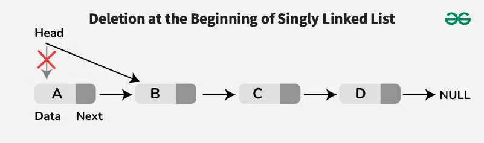
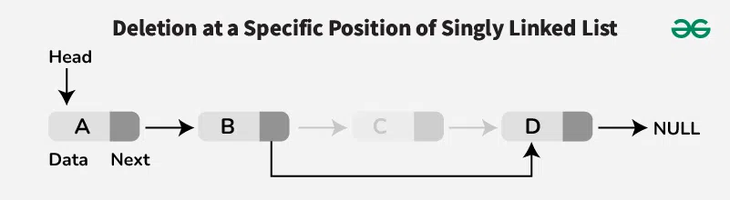
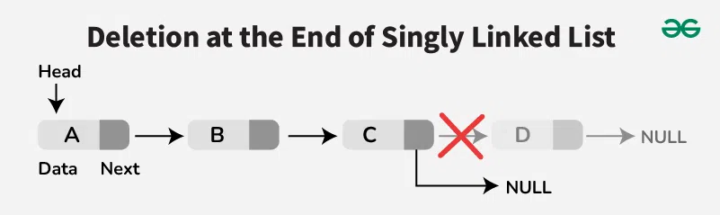

# Chapter 5: Linked List

## What is a Linked List?

A **_linked list_** is a linear data structure where elements (called nodes) are stored in a **non-contiguous memory**, and each node is connected to the next one using a pointer (or link).

## Structure of a Node

Each node has two parts:
1. Data: Store the value
2. Pointer (or link): Stores the address of the next node

```
[Data | Next] → [Data | Next] → [Data | Next] → NULL
```

## 5.4 Traversing a Linked List

To traverse a linked list, you start from the head node and follow the pointers until you reach the end (NULL).

```Cpp
#include <iostream>
using namespace std;

class Node {
public:
    int data;
    Node* next;
    Node(int value) {
        data = value;
        next = NULL;
    }
};

class LinkedList {
public:
    Node* head;
    LinkedList() {
        head = NULL;
    }
    void push_front(int value) {
        Node* newNode = new Node(value);
        newNode->next = head;
        head = newNode;
    }

    void push_back(int value) {
        Node* newNode = new Node(value);
        if (head == NULL) {
            head = newNode;
            return;
        }
        Node* current = head;
        while (current->next != NULL) {
            current = current->next;
        }
        current->next = newNode;
    }

    void traverse() {
        if (head == NULL) { 
            cout << "List is empty." << endl;
            return;
        }
        Node* current = head; // Start from the head
        while (current != NULL) {  // Traverse until the end of the list
            cout << current->data << " -> ";
            current = current->next;    // Move to the next node
        }
        cout << "NULL" << endl; 
    }
};

```
Input:
```cpp
int main() {
    LinkedList list;
    list.push_back(10);
    list.push_back(20);
    list.push_back(30);
    list.traverse();
    return 0;
}
```
Output:
```
10 -> 20 -> 30 -> NULL
```

## Example: 5.7 Counting the number of elements in a linked list

```Cpp
int countElements() {
    int count = 0;
    Node* current = head;
    while (current != NULL) {
        count++;
        current = current->next;
    }
    return count;
}
```

## 5.5 Searching
To search for an element in a linked list, you can traverse the list and compare each node's data with the target value.


```Cpp
Node* search(int item) {
    if (head == NULL) {
        cout << "List is empty." << endl;
        return NULL; // List is empty
    }

    Node* current = head;
    while (current != NULL) {
        if (current->data == item) {
            return current; // Item found
        }
        current = current->next;
    }
    return NULL; // Item not found
}
```
Input:
```cpp
int main() {
    LinkedList list;
    list.push_back(10);
    list.push_back(20);
    list.push_back(30);
    Node* foundNode = list.search(20);
    if (foundNode != NULL) {
        cout << "Element found: " << foundNode->data << endl;
    } else {
        cout << "Element not found." << endl;
    }
    return 0;
}
```

Output:
```
Element found: 20
```

or another method:
```Cpp
void search(int item) {
    if (head == NULL) {
        cout << "List is empty." << endl;
        return; // List is empty
    }

    Node* current = head;
    int pos = 1; // Position counter
    while (current != NULL) {
        if (current->data == item) {
            cout << "Element found: " << current->data << " at position " << pos << endl;
            return; // Item found
        }
        current = current->next;
        pos++; // Increment position counter
    }
    cout << "Element not found." << endl; // Item not found
}
```

Input:
```cpp
int main() {
    LinkedList list;
    list.push_back(10);
    list.push_back(20);
    list.push_back(30);
    list.search(20);
    return 0;
}
```
Output:
```
Element found: 20 at position 2
```

## 5.5 Searching in a sorted linked list
If the linked list is sorted, you can optimize the search by stopping once you encounter a node with a value greater than the target item.

```Cpp
Node* searchSorted(int item) {
    if (head == NULL) {
        cout << "List is empty." << endl;
        return NULL; // List is empty
    }
    Node* current = head;
    while (current != NULL) {
        if (current->data < item) {
            current = current->next; // Continue searching
        } else if (current->data == item) {
            return current; // Item found
        } else {
            break; // No need to continue, item not found
        } 
    }
    return NULL; // Item not found
}
```
Input:
```cpp
int main() {
    LinkedList list;
    list.push_back(10);
    list.push_back(20);
    list.push_back(30);
    Node* foundNode = list.searchSorted(25);
    if (foundNode != NULL) {
        cout << "Element found: " << foundNode->data << endl;
    } else {
        cout << "Element not found." << endl;
    }
    return 0;
}
```
Output:
```
Element not found.
```

or another method:
```Cpp
void searchSorted(int item) {
    if (head == NULL) {
        cout << "List is empty." << endl;
        return; // List is empty
    }
    Node* current = head;
    int pos = 1; // Position counter
    while (current != NULL) {
        if (current->data < item) {
            current = current->next; // Continue searching
            pos++; // Increment position counter
        } else if (current->data == item) {
            cout << "Element found: " << current->data << " at position " << pos << endl;
            return; // Item found
        } else {
            break; // No need to continue, item not found
        } 
    }
    cout << "Element not found." << endl; // Item not found
}
```

Explanation of the Code:
1. The function `searchSorted` takes an integer `item` as input and searches for it in a sorted linked list.
2. It first checks if the list is empty (i.e., `head` is NULL). If it is empty, it prints a message and returns NULL.
3. It initializes a pointer `current` to the head of the list and a position counter `pos` to 1.
4. It enters a loop that continues as long as `current` is not NULL.
5. Inside the loop, it compares the data of the current node with the target `item`.
   - If the current node's data is less than the target item, it moves to the next node and increments the position counter.
   - If the current node's data is equal to the target item, it prints a message indicating that the element was found along with its position and returns the current node.
   - If the current node's data is greater than the target item, it breaks out of the loop since the list is sorted and there is no need to continue searching.
6. If the loop ends without finding the item, it prints a message indicating that the element was not found.
7. The function returns `NULL` if the item is not found in the list.


Input:
```cpp
int main() {
    LinkedList list;
    list.push_back(10);
    list.push_back(20);
    list.push_back(30);
    list.searchSorted(25);
    return 0;
}
```
Output:
```
Element not found.
```

## 5.6 Memory Allocation and Garbage Collection

**Memory Allocation:**
The process of assigning memory toa a program or variable during execution.
Types:
1. Static Allocation: Memory is allocated at compile time (e.g., arrays).
2. Dynamic Allocation: Memory is allocated at runtime (e.g., linked lists using `new Node()`).

**Garbage Collection:**
The process of automatically freeing memory that is no longer in use by the program.

Example:
```cpp
void deleteList() {
    Node* current = head;
    while (current != NULL) {
        Node* temp = current;
        current = current->next;
        delete temp; // Free memory
    }
    head = NULL; // List is now empty
}   
``` 
Input:
```cpp
int main() {
    LinkedList list;
    list.push_back(10);
    list.push_back(20);
    list.push_back(30);
    list.deleteList();
    list.traverse(); // Should indicate the list is empty
    return 0;
}
```
Output:
```
List is empty.
``` 

## 5.7 Insertion into a Linked List
To insert a new node into a linked list, you can use the following methods:

1. **Insertion at the beginning**: Create a new node and make it the new head of the list.

Algorithm **5.4**

```Algorithm

INSFIRST(INFO, LINK, START, AVAIL, ITEM)

1. IF AVAIL = NULL THEN WRITE: OVERFLOW and EXIT
2. Set NEW = AVAIL and AVAIL = LINK(AVAIL)
3. Set INFO(NEW) = ITEM
4. Set LINK(NEW) = START
5. Set START = NEW
6. EXIT
```

```Cpp
void push_front(int value) {
    Node* newNode = new Node(value);
    newNode->next = head;
    head = newNode;
}
```

Explanation of the Code brief line by line:
1. `void push_front(int value) {`
   Declares a function to insert a new node at the beginning of the list.
2. `Node* newNode = new Node(value);`
   Dynamically creates a new node with the given `value`.
3. `newNode->next = head;`
   Makes the new node point to the current first node.
4. `head = newNode;`
   Updates `head` so the new node becomes the first node.

Input:
```cpp
int main() {
    LinkedList list;
    list.push_front(10);
    list.push_front(20);
    list.push_front(30);
    list.traverse();
    return 0;
}
```
Output:
```
30 -> 20 -> 10 -> NULL
``` 

### **Insertion at the end** 

Create a new node and link it to the last node of the list.

```Cpp
void push_back(int value) {
    Node* newNode = new Node(value);
    if (head == NULL) {
        head = newNode;
        return;
    }
    Node* current = head;
    while (current->next != NULL) {
        current = current->next;
    }
    current->next = newNode;
}
```
Explanation of the Code shortly:

1. `Node* newNode = new Node(value);`
   Creates a new node with the provided value.
2. `if (head == NULL) { head = newNode; return; }`
   Checks whether the list is empty. If it is, the new node becomes the first node and the function returns.
3. `Node* current = head;`
   Creates a temporary pointer to traverse from the head.
4. `while (current->next != NULL) { current = current->next; }`
   Moves forward until the last node (whose `next` is `NULL`) is found.
5. `current->next = newNode;`
   Links the new node to the end of the list by setting the `next` pointer of the last node to the new node.

Input:
```cpp
int main() {
    LinkedList list;
    list.push_back(10);
    list.push_back(20);
    list.push_back(30);
    list.traverse();
    return 0;
}
```
Output:
```
10 -> 20 -> 30 -> NULL
```     
3. **Insertion at a specific position**: Create a new node and insert it at the desired position in the list.

Algorithm **5.5**

```Cpp
// Insert at position 1-based
void insertAtPosition(int value, int pos){
    if(pos == 1){
        push_front(value);
        return;
    }
    Node *newNode = new Node(value);
    Node *temp = head;

    for(int i = 1; i < pos - 1 && temp != NULL; i++){
        temp = temp->link;
    }

    if(temp == NULL){
        cout << "Position out of range\n";
        return;
    }

    newNode->link = temp->link;
    temp->link = newNode;
}
```

Explanation of the Code shortly:
1. `if(pos == 1){ push_front(value); return; }`
   Checks if the position is 1. If it is, it calls `push_front` to insert at the beginning and returns.
2. `Node *newNode = new Node(value);`
   Creates a new node with the given value.
3. `Node *temp = head;`
   Initializes a temporary pointer to traverse the list starting from the head.
4. `for(int i = 1; i < pos - 1 && temp != NULL; i++){ temp = temp->link; }`
   Traverses the list to find the node after which the new node will be inserted. It stops if it reaches the end of the list or the desired position.
5. `if(temp == NULL){ cout << "Position out of range\n"; return; }`
   Checks if the position is out of range (i.e., if `temp` is NULL). If it is, it prints an error message and returns.
6. `newNode->link = temp->link;`
   Sets the `link` of the new node to point to the next node in the list.
7. `temp->link = newNode;`
   Updates the `link` of the current node to point to the new node, effectively inserting it into the list.


Input:
```cpp
int main() {
    LinkedList list;
    list.push_back(10);
    list.push_back(20);
    list.push_back(30);
    list.insertAtPosition(15, 2); // Insert 15 at position 2
    list.traverse();
    return 0;
}
```
Output:
```
10 -> 15 -> 20 -> 30 -> NULL
``` 

## Algorithm 5.6

Find the last node of the sorted linked list such that its value is less than the given item.

```Cpp
Node* findLastSmaller(int item){
    Node* current = head;
    Node* lastSmaller = NULL;

    while(current != NULL){
        if(current->data < item){
            lastSmaller = current; // Update last smaller node
            current = current->link; // Move to next node
        } else {
            break; // No need to continue, as the list is sorted
        }
    }
    return lastSmaller; // Return the last smaller node (or NULL if none found)
}
```
Explanation of the Code shortly:
1. `Node* current = head; Node* lastSmaller = NULL;`
   Initializes two pointers: `current` to traverse the list and `lastSmaller` to keep track of the last node with a value smaller than the given item.
2. `while(current != NULL){`
   Starts a loop to traverse the linked list until the end is reached.
3. `if(current->data < item){ lastSmaller = current; current = current      ->link; }`
   If the current node's data is less than the given item, it updates `lastSmaller` to the current node and moves to the next node.
4. `else { break; }`
   If the current node's data is greater than or equal to the given item, it breaks out of the loop since the list is sorted and there is no need to continue searching.
5. `return lastSmaller;`
   Returns the last node that has a value smaller than the given item, or NULL if no such node exists.      


Input:

```cpp
int main() {
    LinkedList list;
    list.push_back(10);
    list.push_back(20);
    list.push_back(30);
    Node* lastSmaller = list.findLastSmaller(25);
    if (lastSmaller != NULL) {
        cout << "Last smaller node: " << lastSmaller->data << endl;
    } else {
        cout << "No smaller node found." << endl;
    }
    return 0;
}
```
Output:

```
Last smaller node: 20
```

## Algorithm 5.7
Insert an item into a sorted linked list.

```Cpp
void insertIntoSorted(int item) {
    if (start == NULL || start->data >= item) {
        push_front(item);
        return;
    }
    Node *location = findLastSmaller(item);
    if (location == NULL) {
        push_back(item);
        return;
    }
    insertIntoLocation(location, item);
}
```

Explanation of the Code shortly:
1. `if (start == NULL || start->data >= item) { push_front(item); return; }`
   Checks if the list is empty or if the first node's data is greater than or equal to the item. If either condition is true, it inserts the item at the front of the list and returns.
2. `Node *location = findLastSmaller(item);`
   Calls the `findLastSmaller` function to find the last node in the list that has a value smaller than the given item.
3. `if (location == NULL) { push_back(item); return; }`
   If no such node is found (i.e., all nodes have values greater than or equal to the item), it inserts the item at the end of the list and returns.
4. `insertIntoLocation(location, item);`
   If a suitable location is found, it calls the `insertIntoLocation` function to insert the item after the node pointed to by `location`.

Input:
```cpp
int main() {
    LinkedList list;
    list.push_back(10);
    list.push_back(20);
    list.push_back(30);
    list.insertIntoSorted(25); // Insert 25 into the sorted list
    list.traverse();
    return 0;
}
```
Output:
```
10 -> 20 -> 25 -> 30 -> NULL
```

# Deletion

## Deletion from a linked list 

To delete a node from a linked list, it visually looks like this: 






## Algorithm 5.8
Delete at a position

```Cpp
void deleteAtPosition(int pos) {

    if (head == NULL) {
        cout << "List is empty." << endl;
        return; // List is empty
    }
    if (pos == 1) {
        Node* temp = head;
        head = head->next; // Move head to the next node
        delete temp; // Free memory of the old head
        return;
    }
    Node* current = head;
    for (int i = 1; i < pos - 1 && current != NULL; i++) {
        current = current->next; // Traverse to the node before the one to delete
    }
    if (current == NULL || current->next == NULL) {
        cout << "Position out of range." << endl;
        return; // Position is out of range
    }
    Node* temp = current->next; // Node to be deleted
    current->next = temp->next; // Bypass the node to be deleted
    delete temp; // Free memory of the deleted node
}
```

Explanation of the Code shortly:
1. The function `deleteAtPosition` takes an integer `pos` as input, which represents the position of the node to be deleted (1-based index).
2. It first checks if the list is empty (i.e., `head` is NULL). If it is, it prints a message and returns.
3. If the position to delete is 1, it updates the head to the next node and deletes the old head node, then returns.
4. It initializes a pointer `current` to traverse the list starting from the head.
5. It uses a loop to traverse the list until it reaches the node just before the one to be deleted (i.e., position `pos - 1`). If it reaches the end of the list before finding the position, it prints an error message and returns.
6. If the position is valid, it sets a temporary pointer `temp` to the node that needs to be deleted (i.e., `current->next`), updates the `next` pointer of the current node to bypass the node to be deleted, and then deletes the node pointed to by `temp` to free memory.   

or another method using recursion:
```Cpp
Node* deleteAtPosition(Node* head, int pos) {
    if (head == NULL) {
        cout << "List is empty." << endl;
        return NULL; // List is empty
    }
    if (pos == 1) {
        Node* temp = head;
        head = head->next; // Move head to the next node
        delete temp; // Free memory of the old head
        return head;
    }
    head->next = deleteAtPosition(head->next, pos - 1); // Recursively delete the next node
    return head;
}
``` 

Explanation of the Code shortly:
1. The function `deleteAtPosition` takes a pointer to the head of the list and an integer `pos` as input, which represents the position of the node to be deleted (1 based index).
2. It first checks if the list is empty (i.e., `head` is NULL). If it is, it prints a message and returns NULL.
3. If the position to delete is 1, it updates the head to the next node and deletes the old head node, then returns the new head.
4. For positions greater than 1, it recursively calls itself to delete the next node in the list, passing `head->next` and `pos - 1` as arguments. This effectively traverses the list until it reaches the node to be deleted.
5. After the recursive call, it returns the head of the modified list, which allows the changes to propagate back up the call stack.    

or another method using location which value will be erased and location before the erased value:

```Cpp
void deleteAtLocation(Node* location, Node* prev) {
    if (location == NULL) {
        cout << "Node to delete not found." << endl;
        return; // Node to delete not found
    }
    if (prev == NULL) {
        head = location->next; // Deleting the head node
    } else {
        prev->next = location->next; // Bypass the node to be deleted
    }
    delete location; // Free memory of the deleted node
}
```

Explanation of the Code shortly:
1. The function `deleteAtLocation` takes two pointers as input: `location`, which points to the node that needs to be deleted, and `prev`, which points to the node before the node to be deleted.
2. It first checks if the `location` pointer is NULL, which would indicate that the node to delete was not found. If it is NULL, it prints a message and returns.
3. If `prev` is NULL, it means that the node to be deleted is the head of the list. In this case, it updates the head to point to the next node after the one being deleted.
4. If `prev` is not NULL, it means that the node to be deleted is not the head. In this case, it updates the `next` pointer of the previous node to bypass the node to be deleted, effectively removing it from the list.
5. Finally, it deletes the node pointed to by `location` to free the memory allocated for that node.


## Algorithm 5.9 

Find location and previous location of the node to be deleted, then call deleteAtLocation.

```Cpp

void findLocationandPrev(int item, Node*& location, Node*& prev) {
    location = head;
    prev = NULL;
    while (location != NULL && location->data != item) {
        prev = location; // Update previous node
        location = location->next; // Move to next node
    }
}
```
Explanation of the Code shortly:
1. The function `findLocationandPrev` takes an integer `item` and two reference pointers `location` and `prev` as input. The function will search for the node containing the given item and update the `location` pointer to point to that node, while the `prev` pointer will point to the node immediately before it.
2. It initializes `location` to the head of the list and `prev` to NULL.
3. It enters a loop that continues as long as `location` is not NULL and the data of the current node does not match the target item.
4. Inside the loop, it updates the `prev` pointer to the current `location` and moves the `location` pointer to the next node in the list.
5. If the loop ends because `location` becomes NULL, it means the item was not found in the list, and both `location` and `prev` will be set accordingly (with `location` being NULL). If the item is found, `location` will point to the node containing the item, and `prev` will point to the node immediately before it (or NULL if the found node is the head).    

# Algorithm 5.10
Deletion at the first occurance 

```Cpp
void deleteFirstOccurrence(int item) {
    Node* location;
    Node* prev;
    findLocationandPrev(item, location, prev);
    deleteAtLocation(location, prev);
}
```
Explanation of the Code shortly:
1. The function `deleteFirstOccurrence` takes an integer `item` as input, which represents the value of the node to be deleted from the linked list.
2. It declares two pointers `location` and `prev` to store the location of the node to be deleted and its previous node, respectively.
3. It calls the `findLocationandPrev` function, passing the target item and the reference pointers `location` and `prev`. This function will search the linked list for the first occurrence of the item and update `location` to point to the node containing the item and `prev` to point to the node immediately before it.
4. After `findLocationandPrev` returns, it calls the `deleteAtLocation` function, passing the `location` and `prev` pointers. This function will handle the actual deletion of the node from the linked list, taking care of edge cases such as deleting the head node or a node in the middle of the list. 

Input:
```cpp
int main() {
    LinkedList list;
    list.push_back(10);
    list.push_back(20);
    list.push_back(30);
    list.deleteFirstOccurrence(20); // Delete the first occurrence of 20
    list.traverse();
    return 0;
}
```
Output:
```
10 -> 30 -> NULL
```

