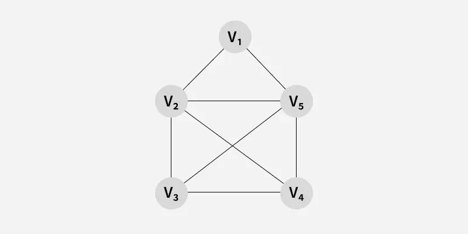

# Data Structure and Algorithm

This is my personal note. I tried my best to include everything I learned through my DSA classes. Hopefully this note will cover up everything. Peace! 

``PS: This note is based on Schaums Outline Series Book and my own learnings.``

---
# Table of Contents
- [Intro](#️-intro)
- [Complexity Analysis](#--complexity-analysis-time--space)
- [Preliminaries](#️-preliminaries)
- [String Processing](#string-processing)
- [Arrays]()
- [Pointers](#pointers-g)
- [Linked Lists](#linked-list)
- [Stack]()
- [Queue]()
- [Recursion]()     
- [Trees](#-tree)
- [Graphs](#-graph)

---
## ⛩️ Intro

>A data structure is a particular way of organizing data in a computer so that it can be used effectively. The idea is to reduce the space and time complexities of different tasks. Here are some common data structure:
- Arrays
- Linked Lists
- Stack
- Queues
- Trees
- Graphs
- Hash Tables
  
### Abstract Data Types

>An abstract data type (ADT) is an abstraction of a data structure which provides only the interface to which a data structure must adhere to. Ther interface does not give any specific details about how something should be implemented or in what programming language.

---


## ⏰ 💻 Complexity Analysis (Time & Space)

In **computer science**, complexity analysis helps us understand **how efficient an algorithm is** in terms of:

1. **Time Complexity** → How much time an algorithm takes
2. **Space Complexity** → How much memory an algorithm uses

We usually analyze complexity using **Big-O notation**.


## 1. Time Complexity

Time complexity measures how the **execution time grows with input size (n)**.

### Common Time Complexities

| Notation       | Name         | Example                          |
| -------------- | ------------ | -------------------------------- |
| **O(1)**       | Constant     | Accessing an array element       |
| **O(log n)**   | Logarithmic  | Binary search                    |
| **O(n)**       | Linear       | Traversing an array              |
| **O(n log n)** | Linearithmic | Merge sort                       |
| **O(n²)**      | Quadratic    | Nested loops                     |
| **O(2ⁿ)**      | Exponential  | Recursive Fibonacci              |
| **O(n!)**      | Factorial    | Traveling Salesman (brute force) |

---

### Example 1: Linear Time

```c
for(int i = 0; i < n; i++)
    printf("%d", i);
```

⏱ **Time Complexity:** `O(n)`

---

### Example 2: Nested Loop

```c
for(int i = 0; i < n; i++)
  for(int j = 0; j < n; j++)
    printf("*");
```

⏱ **Time Complexity:** `O(n²)`

---

### Best, Average & Worst Case

| Case        | Meaning       |
| ----------- | ------------- |
| **Best**    | Minimum time  |
| **Average** | Expected time |
| **Worst**   | Maximum time  |

📌 Example: **Linear Search**

* Best: `O(1)`
* Worst: `O(n)`
* Average: `O(n)`

---

## 2. Space Complexity

Space complexity measures **extra memory used** by the algorithm.

### Components:

1. **Input Space**
2. **Auxiliary Space** (temporary variables, recursion stack)

---

### Example: Constant Space

```c
int sum(int a, int b) {
    return a + b;
}
```

🧠 **Space Complexity:** `O(1)`

---

### Example: Linear Space

```c
int arr[n];
```

🧠 **Space Complexity:** `O(n)`

---

### Recursion Example

```c
int fact(int n){
    if(n == 0) return 1;
    return n * fact(n - 1);
}
```

🧠 **Space Complexity:** `O(n)` (recursive call stack)

---

## 3. Big-O, Big-Ω, Big-Θ

| Notation      | Meaning                    |
| ------------- | -------------------------- |
| **Big-O (O)** | Upper bound (worst case)   |
| **Big-Ω (Ω)** | Lower bound (best case)    |
| **Big-Θ (Θ)** | Tight bound (exact growth) |

---

## 4. How to Analyze Complexity (Steps)

1. Ignore constants
2. Ignore lower-order terms
3. Focus on the fastest-growing term

Example:

```
T(n) = 3n² + 5n + 7 → O(n²)
```

---

## 5. Why Complexity Analysis is Important?

✔ Compare algorithms

✔ Predict performance

✔ Optimize code

✔ Essential for competitive programming & interviews

---
## :spiral_notepad: Preliminaries 

## 2.2 Mathematical notation and Function

## Floor and Ceiling Function

## 1. Floor Function

### Symbol:

$$
\lfloor x \rfloor
$$

### Definition:

The **floor of a number** (x) is the **greatest integer less than or equal to (x)**.

### Mathematical expression:

$$
\lfloor x \rfloor = n \quad \text{where } n \in \mathbb{Z} \text{ and } n \le x < n+1
$$

### Examples:
$$
[
\lfloor 3.7 \rfloor = 3
]
[
\lfloor 5 \rfloor = 5
]
[
\lfloor -2.3 \rfloor = -3
]
$$
📌 **Note:** Floor always goes **downward** toward (-\infty).

---

## 2. Ceiling Function

### Symbol:

$$
\lceil x \rceil
$$

### Definition:

The **ceiling of a number** (x) is the **smallest integer greater than or equal to (x)**.

### Mathematical expression:

$$
\lceil x \rceil = m \quad \text{where } m \in \mathbb{Z} \text{ and } m-1 < x \le m
$$

### Examples:

$$
\lceil 3.7 \rceil = 4
$$
$$
\lceil 5 \rceil = 5
$$
$$
\lceil -2.3 \rceil = -2
$$

📌 **Note:** Ceiling always goes **upward** toward $(+\infty)$.

---

## 3. Combined Property

For any real number (x):

$$
\lfloor x \rfloor \le x \le \lceil x \rceil
$$

---

## 4. Visual intuition

If (x = 4.2):

```
4 -------- x -------- 5
^                      ^
floor(x)            ceiling(x)
```

---

### Quick memory trick 🧠

* **Floor = ground (down)**
* **Ceiling = roof (up)**


## 📌 Chapter 2: `2.3` `Algorithm Notation`

### 2.1 Largest Element in array

Used `goto` method here. (not recommended)

```cpp
#include <bits/stdc++.h>
using namespace std;

void LargestElementInArray(int DATA[], int N)
{
    int K = 0, LOC = 0, MAX = DATA[0];
increment_counter:
    K = K + 1;
    if (K == N)
    {
        cout << "LOC = " << LOC << ", MAX = " << MAX << "\n";
        return;
    }
    if (MAX < DATA[K])
    {
        LOC = K;
        MAX = DATA[K];
    }
    goto increment_counter;
}

int main()
{
    int DATA[] = {3, 5, 9, 2};
    int N = sizeof(DATA) / sizeof(int);
    LargestElementInArray(DATA, N);
    return 0;
}
```

### Input & Output

**Input**
```cpp
{3, 5, 9, 2}
```
**Output**
```
LOC = 2, MAX = 9
```

### Explanation
### Function: `LargestElementInArray()`
```cpp
void LargestElementInArray(int DATA[], int N)
```

**Variables:**
```cpp
int K = 0, LOC = 0, MAX = DATA[0];
```
- `K` = loop counter (index)
- `LOC` = location (index) of largest element
- `MAX` = current largest value

**Use of `goto` statement:**
```cpp
increament_counter
```
Increament index: `K = K + 1`
End Condition: `if (K == N)`
Print Result:
```cpp
cout << "LOC = " << LOC << ", MAX = " << MAX << "\n";
return;
```

### Time & Space Complexity

#### ⏱ Time Complexity

O(N) → scans array once

#### 💾 Space Complexity

O(1) → no extra memory

Check on [2.3 Largest Element in array (while loop)](#23-largest-element-in-array-while-loop) for logic flow.


---
### 2.2 Quadratic equation

```cpp
#include <iostream>
#include <math.h>
using namespace std;

int main()
{
    int A, B, C;
    cin >> A >> B >> C;
    int D = B * B - 4 * A * C;
    if (D > 0)
    {
        float X1 = (-B + sqrt(D)) / (2 * A);
        float X2 = (-B - sqrt(D)) / (2 * A);
        cout << X1 << " and " << X2 << "\n";
    }
    else if (D == 0)
    {
        float X = -B / (2.0 * A);
        cout << "UNIQUE SOLUTION : " << X << "\n";
    }
    else 
    {
        cout << "NO REAL SOLUTIONS" << "\n";
    }
    return 0;
}
```

### Input & Output
**Input:**
```
1 1 2
```
**Output:**
```
NO REAL SOLUTIONS
```


**Input**
```
1 2 1
```
**Output**
```
UNIQUE SOLUTION : -1
```

### Time & Space Complexity

- Time Complexity: O(1)
- Space Complexity: O(1)

---

### 2.3 Largest Element in array (while loop)

```cpp
#include <iostream>
using namespace std;

void LargestElementInArray(int DATA[], int N)
{
    int K = 0, LOC = 0, MAX = DATA[0];
    while (K < N)
    {
        if (MAX < DATA[K])
        {
            LOC = K;
            MAX = DATA[K];
        }
        K = K + 1;
    }
    cout << "LOC = " << LOC << ", MAX = " << MAX << "\n";
}

int main()
{
    int DATA[] = {3, 5, 9, 2};
    int N = sizeof(DATA) / sizeof(int);
    LargestElementInArray(DATA, N);
    return 0;
}
```

### Input & Output

**Input**
```cpp
{3, 5, 9, 2}
```
**Output**
```
LOC = 2, MAX = 9
```

---
### 2.4 Linear Search
```cpp
#include <bits/stdc++.h>
using namespace std;

void LinearSearch(int DATA[], int N, int ITEM)
{
    int K = 0, LOC = -1;
    while (LOC == -1 && K < N)
    {
        if (ITEM == DATA[K])
            LOC = K;
        K = K + 1;
    }
    if (LOC == -1)
        cout << "ITEM is not on the array DATA\n";
    else
        cout << LOC << " is the location of ITEM\n";
    return;
}

int main()
{
    int DATA[] = {3, 5, 9, 2};
    int N = sizeof(DATA) / sizeof(int);
    int ITEM = 9;
    LinearSearch(DATA, N, ITEM);
    return 0;
}
```

### Input & Output:

**Input:**
```cpp
DATA = {3, 5, 9, 2}
ITEM = 9
```
**Output:**
```cpp
2 is the location of ITEM
```

### Explanation:
### Function: `void LinearSearch()`
- **Parameters:** `int DATA[], int N, int ITEM`
- **Purpose:** Search `ITEM` in array `DATA` of size `N`

**Variables:**

```cpp
int K = 0, LOC = -1
```
- `K` : index used to scan the array
- `LOC` : stores the location of the `ITEM`
- `LOC = -1` means `ITEM` not found yet.


**Loop:**

```cpp
while (LOC == -1 && K < N)
{
    // if current element matches item, stores the location
    if (ITEM == DATA[K])
        LOC = K;

    // increament
    K = K + 1;
}
```
---

## String Processing

**What is a string?**
> A finite sequence of characters called a string. 

> The number of characters is called the _empty string_ or the _null string_.

> 


---
## Pointers 👉

A pointer is a variable that stores the memory address of another variable instead of storing a value directly.

In simple word:
> Pointer = address holder

Pointers allows programs to:
* Access and modify data efficiently
* Work with dynamic memory
* Share data between functions
* Build advanced data structures

Basic Pointer Syntax:

```c
int x = 10;
int *p = &x;
```
* `x` - normal variable
* `&x` - address of `x`
* `p` - pointer stroing the address of `x`
* `*p` - value at that address ([dereferencing](https://www.geeksforgeeks.org/cpp/dereference-pointer-in-c/))

### Pointers in Data Structure

In Data Structure, pointers are mainly used to **connect data elements dynamically in memory**. They allow us to create structures whose size can grow or shrink at runtime.

### Pointer based Node Structure

Almost every pointer-based data structure start with a node.
```c++
struct Node {
    int data;
    Node* next;
};
```
* `data` - stores value
* `next` - pointer to another node

This is the backbone of many data structures.

### Pointer in Linked Lists

Single Linked Lists:
```c++
Node* head = nullptr;
```

Creating a node dynamically:
```c++
Node* newNode = new Node();
newNode->data = 10;
newNode->next = nullptr;
```
Connecting nodes:
```
head = newNode;
```
Traversal using pointer:
```c++

Node* temp = head;

while(temp != nullptr){
    cout << temp->data << " ";
    temp = temp->next;
}
```
📌 pointer link nodes together

---
## Linked List

A linked list is a linear data structure, in which the elements are not stored at contiguous memeory locations. The elements in a linked list are linked using [*pointers*](#pointers-).

### Types of Linked Lists

1. Singly Linked List
    * Each node points to thte next node
    * Last node points to `NULL`
```
[data | next] → [data | next] → NULL
```
2. Doubly Linked List
    * Each node has two pointers
      * Previous
      * Next
``` 
NULL ← [prev | data | next] ↔ [prev | data | next] → NULL
```
3. Circular Linked List
   * Last node points back to the first node
   * No `NULL`
```
10 → 20 → 30
↑         ↓
←←←←←←←←←←

```
### Implementations:


---

## :christmas_tree: Tree 

>A _**tree**_ is a **hierarchical** data structure used to organice and represent data in a **parent-child** relationship. It consists of nodes, where the topmost node is called the **root**, and every other node can have one or more child nodes. 


## 🔹 Basic Terminology
- Node: Each element in the tree
- Root: Topmost node
- Edge: Connection between two nodes
- Parent / Child: Relationship between nodes
- Leaf: Node with no children
- Subtree: A tree inside a tree
- Height: Longest path from a node to a leaf
- Depth: Distance from root to a node

---

## 💠 Graph 

A **graph** consists of:
- **Vertices (Nodes)** - represent entities
- **Edges (Links)** - represent connections between those entities
  
Formally, a graph is written as:

$G = (V, E)$ 

where
- V = set of vertices / nodes
- E = set of edges connecting the vertices / nodes


---

## Types of Graph

### 1. Weighted Graph

A **weighted graph** is a graph where each edge has a number (weight) that represents distance, cost, or time.


### 2. Unweighted Graph

An **unweighted graph** is agraph wehre all edges are treated equally, with no extra values like distance or cost.



## Based on Edge Direction

### 3. Undirected Graph

A graph in which edges do not have any direction. That is the nodes are [unordered pairs](https://en.wikipedia.org/wiki/Unordered_pair) in the definition of every edge.

### 4. Directed Graph

A graph in which edge has direction. That is  the nodes are [ordered pairs](https://www.geeksforgeeks.org/maths/ordered-pair/) in the definition of every edge.


---
### ♦️ Basic terminologies

There are some basic terminologies:

### 1. Vertex (Node)

A **vertex** is a fundamental unit of a graph that represents an object or entity.

- Example: A city, computer, or user
- Denoted as: $V$

---

### 2. Edge

An **edge** is a connection between two vertices.

- Example: A road between two cities
- Denoted as: $E$

---

### 3. Directed Edge

An edge that has a **direction** (one-way).

- Example: A → B (A can go to B, but not back)

---

### 4. Undirected Edge

An edge with **no direction** (two-way).

- Example: A — B

---

### 5. Degree of a Vertex

The **degree** is the number of edges connected to a vertex.

🔹 In **undirected graph**:

* Degree = number of connected edges

🔹 In **directed graph**:

* **In-degree** → incoming edges
* **Out-degree** → outgoing edges

---

### 6. Path

A **path** is a sequence of vertices connected by edges.

- Example: A → B → C
- Path length = number of edges in the path

---

### 7. Cycle

A **cycle** is a path that starts and ends at the **same vertex**.

🔹 Example: A → B → C → A

---

### 8. Simple Path

A path that **does not repeat any vertex**.

---

### 9. Connected Graph

A graph is **connected** if there is a path between **every pair of vertices**.

---

### 10. Disconnected Graph

A graph where **some vertices are not connected** to others.

---

### 11. Weighted Graph

A graph where each edge has a **weight** (cost, distance, time).

---

### 12. Unweighted Graph

A graph where edges have **no weights**.

---

### 13. Loop (Self-loop)

An edge that connects a vertex to **itself**.

🔹 Example: A → A

---

### 14. Adjacent Vertices

Two vertices are **adjacent** if they are directly connected by an edge.

---

### 15. Subgraph

A **subgraph** is a graph formed from a subset of vertices and edges of another graph.

---

### 16. Complete Graph

A graph where **every pair of vertices** is connected by an edge.

🔹 For $n$ vertices, edges = $\frac{n(n-1)}{2}$

---

### 17. Tree

A **special graph** that is:

* Connected
* Acyclic (no cycles)
* Has ( n-1 ) edges for ( n ) vertices

---

### 18. Forest

A collection of **disjoint trees**.

---

## ❗Graph Representation

Ways to store graphs in memory:

* **Adjacency Matrix**
* **Adjacency List**
---

**Graph representation** means how a graph is stored in computer memory so that we can process it efficiently using algorithms like **BFS, DFS, Dijkstra, etc.**

There are **two main ways** to represent a graph:

---

## 1. Adjacency Matrix

### Definition

An **adjacency matrix** is a **2D array** of size `V × V`, where `V` is the number of vertices.

* `matrix[i][j] = 1` → there is an edge from `i` to `j`
* `matrix[i][j] = 0` → no edge

For a **weighted graph**, the value stores the **weight** instead of `1`.

### Example

Graph:

```
0 —— 1
|    |
|    |
2 —— 3
```

Adjacency Matrix:

```
    0  1  2  3
0 [ 0  1  1  0 ]
1 [ 1  0  0  1 ]
2 [ 1  0  0  1 ]
3 [ 0  1  1  0 ]
```

### Characteristics

* Easy to check if an edge exists
* Uses more memory

### Time & Space

* **Space**: `O(V²)`
* **Edge check**: `O(1)`
* **Traversal**: `O(V²)`

### When to Use

* ✔ Dense graphs
* ✔ Small number of vertices

---

## 2. Adjacency List

### Definition

An **adjacency list** stores a list of neighbors for each vertex.

Usually implemented using:

* Array of lists
* Vector of vectors (C++)

### Example

```
0 —— 1
|    |
|    |
2 —— 3
```

Adjacency List:

```
0 → 1, 2
1 → 0, 3
2 → 0, 3
3 → 1, 2
```

For weighted graph:

```
0 → (1,5), (2,3)
```

### Characteristics

* Saves memory
* Slightly slower edge lookup

### Time & Space

* **Space**: `O(V + E)`
* **Edge check**: `O(deg(V))`
* **Traversal**: `O(V + E)`

### When to Use

* ✔ Sparse graphs
* ✔ Large graphs
* ✔ Most real-world problems

---

## Comparison Table

| Feature          | Adjacency Matrix | Adjacency List   |
| ---------------- | ---------------- | ---------------- |
| Space            | O(V²)            | O(V + E)         |
| Edge Check       | O(1)             | O(deg(V))        |
| Best For         | Dense graphs     | Sparse graphs    |
| Memory Efficient | ❌                | ✅                |
| Implementation   | Simple           | Slightly complex |

---

## Exam Tip

* **Matrix → fast edge lookup**
* **List → memory efficient**

---

## 🌟 Path Matrix
A **path matrix** tells us **whether a path exists** between every pair of vertices in a graph.

### Definition

For a graph with `V` vertices, the **path matrix** is a `V × V` matrix `P` where:

* `P[i][j] = 1` → **there exists at least one path** from vertex `i` to vertex `j`
* `P[i][j] = 0` → **no path exists** from `i` to `j`

👉 Unlike an adjacency matrix (which checks **direct edges**), a path matrix checks **any path (direct or indirect)**.

---

## Example

Graph:

```
0 → 1 → 2
```

### Adjacency Matrix

```
    0  1  2
0 [ 0  1  0 ]
1 [ 0  0  1 ]
2 [ 0  0  0 ]
```

### Path Matrix

```
    0  1  2
0 [ 0  1  1 ]   ← 0 can reach 2 through 1
1 [ 0  0  1 ]
2 [ 0  0  0 ]
```

---

## Key Differences

| Matrix           | Meaning                   |
| ---------------- | ------------------------- |
| Adjacency Matrix | Direct edge exists or not |
| Path Matrix      | Any path exists or not    |

---

## How to Find Path Matrix

* Using **Warshall’s Algorithm**
* Using repeated **DFS/BFS** from each vertex

---

## Properties

* Size: `V × V`
* Useful to test **reachability**
* Helps determine if a graph is **strongly connected**

---

## Exam Tip ⭐

📌 *“Path matrix represents transitive closure of a graph.”*

---

## ⭐ Warshall's Algorithm: Transitive Closure

This is an algorithm which gives us a **path matrix** that tells us whether a path exists between every pair of vertices (direct or indirect).

This algorithm -
* Determines whether a path exists between every pair of vertices
* Considers direct and indirect paths

### Key Idea:
For every vertex `k`, check:
> Can vertex `i` reach vertex `j` through `k`?

If yes, mark it as reachable.

### Formula:

$P[i][j] = P[i][j]\ || \ (\ P[i][j] \And\And \  P[k][j]\ )$


### Code:

```C++
#include <bits/stdc++.h>
using namespace std;

int main()
{
    int n;
    cin >> n;
    int mat[n][n];

    // taking input
    for (int i = 0; i < n; i++)
    {
        for (int j = 0; j < n; j++)
        {
            cin >> mat[i][j];

            // comment these two following two lines for path matrix
            // (because we need 0 for logical operations -> binary AND, OR)
            //   if (mat[i][j] == 0)     // if the value is 0,
            //     mat[i][j] = (int)1e7; // we set it to a higher value
        }
    }

    // warshall's algorithm
    for (int k = 0; k < n; k++)
    {
        for (int i = 0; i < n; i++)
        {
            for (int j = 0; j < n; j++)
            {
                mat[i][j] = mat[i][j] || (mat[i][k] && mat[k][j]); // for path matrix
            }
        }
    }

    // printing matrix
    cout << endl;
    for (int i = 0; i < n; i++)
    {
        for (int j = 0; j < n; j++)
        {
            cout << mat[i][j] << " ";
        }
        cout << endl;
    }

    return 0;
}

```

### Complexity

*   Time: O$(V^3)$
*   Space: O$(V^2)$

### Input & Output
* **Input:** Adjacency Matrix
* **Output:** Path Matrix


## 🌟 Floyd-Warshall Algorithm

Floyd-Warshall is an algorithm used to find the shortest paths between all pairs of vertices in a graph.

This algorithm -
* Computes minimum distance from every vertex to every other vertex
* Works for directed and undirected graphs
* Can handle negative edge weights
  * ⚠️ but not negative cycles.

### Core Idea (Same Structure as Warshall)

For every vertex `k`, check:
> Is the path from `i` to `j` shorter via `k`?
  
## Formula

$dist[i][j] = min(dist[i][j],dist[i][k]+dist[k][j])$

Code: 
```C++
#include <bits/stdc++.h>
using namespace std;

int main()
{
    int n;
    cin >> n;
    int mat[n][n];

    // taking input
    for (int i = 0; i < n; i++)
    {
        for (int j = 0; j < n; j++)
        {
            cin >> mat[i][j];

            // comment these two following two lines for path matrix
            // (because we need 0 for logical operations -> binary AND, OR)
            if (mat[i][j] == 0)     // if the value is 0,
                mat[i][j] = (int)1e7; // we set it to a higher value
        }
    }

    // warshall's algorithm
    for (int k = 0; k < n; k++)
    {
        for (int i = 0; i < n; i++)
        {
            for (int j = 0; j < n; j++)
            {
                mat[i][j] = min(mat[i][j], mat[i][k] + mat[k][j]); // shortest paths
            } 
        }
    }
    
    // printing matrix
    cout << endl;
    for (int i = 0; i < n; i++)
    {
        for (int j = 0; j < n; j++)
        {
            cout << mat[i][j] << " ";
        }
        cout << endl;
    }

    return 0;
}
```
## Linked Representation of a Graph

We will only focus


## BFS - Breadth First Search